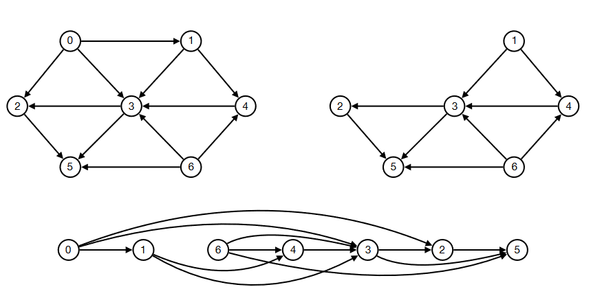

Når man laver BFS og DFS tager man størst til mindst i stacks og queues

Begreber angående træer
Degree: Antallet af naboer til en node
Indegree og outdegree er pilen peger ind og ud
Depth er antallet af noder uden roden.
Height er for en vertice hvor langt der er ned til et leaf. Height for et tree er lig root.
Diameter er længste vej mellem to noder.

## 1.1 
A[0] -> A[5,3,2]

## 1.2
BFS in a
Mark 4, queue 0,6,1. Mark 0, queue 5,3,2. Mark 6. Mark 1. Mark 5. Mark 3. Mark 2
DFS
Mark 5, mark 9, mark 4, mark 0, mark 3, mark 1, mark 7, mark 6, mark 2

## 1.3
A is DAG, C is not dag as 9->4->0->5

## 1.4
a has no strongly connected components. in c: 4 and 0 are strongly connected and 5->7->6->2->0->5 are strongly connected.

## 1.5
it has 2. 0->1->2->5 and 0->3->4->5

## 1.6
none, because that is automatically a cycle if you can go 2 ways.

## 2.1
Just imagine it as a graph with edges that are directed and most that are not directed, and then just use breath-first as that finds the fastes way through the snakes and ladder. This must also be the way with the fewest rounds.

## 3.1
.
No because for example here it would go wrong in the left graph as it would put 3 before 4 and that would be wrongly sorted

## 3.2
Check the ordering with a search if any vertices point to a vertice already marked.

## 3.3
No because if there is a DAG then it automatically means it has a topological sorting.

## 3.4

## 5
Lav personerne til grafer ved at modellere deres fødsel og død som vertices. Lav kanter hvis en begivenhed skete før noget andet. Så hav kant fra fødsel til død. 

## 6
Because if G is DAG then it means that G can be placed so that the first vertice can be removed which is basically how a topological ordering works. If G is DAG then this must be true and therefore it must have a topological ordering.

## 7.1
Vi hælder over i f5 en gang og så fra f5 over i f3. Så hælder vi fra f3 over i f8 og fra f5 til f3. Der er nu 2 i f3 og 6 i f8. Så hælder vi over i f5 og derfra over i f3. Der er nu 4 i f5.

## 7.2

